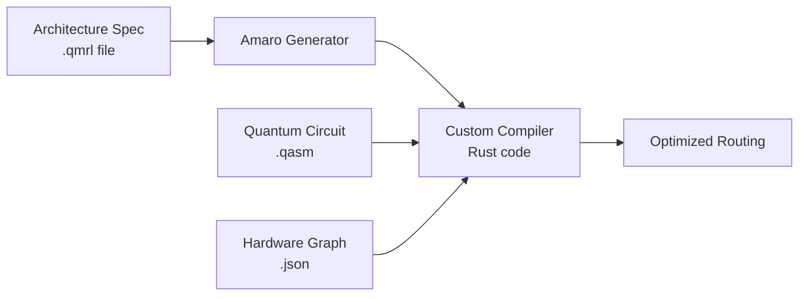

# Amaro Compiler Generator

[](LICENSE)
[](https://www.rust-lang.org/)
[](https://marketplace.visualstudio.com/items?itemName=keshavsharma-wisc.amaro-vscode)

**Amaro** is a domain-specific language (DSL) and compiler generator for quantum gate routing. It allows researchers to specify routing strategies for different quantum architectures once and automatically generate optimized, hardware-specific compilers.

Think of Amaro as **yacc/bison for quantum computing** which helps you write high-level routing specifications and get a production compiler.

---

## Who Is This For?

- **Quantum compiler researchers** building routing algorithms
- **Systems researchers** working on quantum-classical interfaces
- **PhD students** prototyping new quantum architectures
- **Hardware teams** needing custom compilers for novel devices

---

## What Problem Does This Solve?

Quantum computers have physical constraints. Not every qubit can interact with every other qubit. Running a quantum algorithm requires "routing" operations around these limitations, similar to how GPS routes around road closures.

**The Challenge:** Every quantum architecture (NISQ, surface code, trapped ions, Rydberg atoms) has different constraints and requires different routing strategies. Writing custom compilers for each is tedious and error-prone.

**Amaro's Solution:** Describe your architecture's constraints and routing logic in ~50 lines of declarative code. Amaro generates a full compiler with optimized search algorithms.

### How It Works



---

## Quick Start

### Prerequisites
- **Rust** 1.90.0 or later ([install](https://rustup.rs))
- **Python** 3.8+ (for benchmark scripts)
- Bash shell

### Installation

```bash
git clone https://github.com/qqq-wisc/qmr-compiler-generator
cd qmr-compiler-generator
cargo build --release
```

### Basic Usage

**Compile a routing specification:**
```bash
./amaro compile problem-descriptions/nisq.qmrl
```

The generated compiler appears in `generated-solvers/nisq/`.

**Run the compiler on a quantum circuit:**
```bash
./amaro run problem-descriptions/nisq.qmrl <circuit.qasm> <arch.json> --onepass
```

Where:
- `<circuit.qasm>` : Quantum circuit in OpenQASM format
- `<arch.json>` : Architecture connectivity graph in JSON
- `--sabre` : Search algorithm (options: `--sabre`, `--onepass`, `--amaro`)

**Debug a specification:**
```bash
./amaro debug problem-descriptions/nisq.qmrl
```

Debug output appears in `generator/debug/`.

---

## Writing Amaro Specifications

An Amaro file (`.qmrl`) defines four components:

### 1. RouteInfo - How to Implement Gates

Describes which gates you're routing and how to realize them on hardware.

**Example (NISQ):**
```amaro
RouteInfo:
    routed_gates = CX
    GateRealization{u : Location, v : Location}
    realize_gate = if Arch.contains_edge((State.map[Gate.qubits[0]], State.map[Gate.qubits[1]]))
        then Some(GateRealization{u = State.map[Gate.qubits[0]], v = State.map[Gate.qubits[1]]})
        else None
```

**Explanation:**
- **routed_gates**: Which gate types this handles (here, just `CX`)
- **GateRealization**: The data structure storing implementation details
- **realize_gate**: Logic to check if a gate can be executed (NISQ requires qubits to be adjacent)

### 2. TransitionInfo - How to Move Qubits

Defines the operations that change qubit placement between routing steps.

**Example (NISQ SWAP):**
```amaro
TransitionInfo:
    Transition{edge : (Location, Location)}
    get_transitions = (map(|x| -> Transition{edge = x}, Arch.edges())).push(Transition{edge = (Location(0), Location(0))})
    apply = value_swap(Transition.edge.(0), Transition.edge.(1))
    cost = if (Transition.edge) == (Location(0), Location(0))
        then 0.0
        else 1.0
```

**Explanation:**
- **get_transitions**: Generate all possible SWAP operations (plus identity)
- **apply**: Execute the transition (swap qubit locations)
- **cost**: How expensive the transition is (0 for identity, 1 for actual SWAPs)

> **Key Concept:** `TransitionInfo.cost` defines the cost of *moving between configurations* (e.g., performing a SWAP), while `StateInfo.cost` (below) defines the cost of *being in a specific configuration*.

### 3. ArchInfo - Hardware Parameters

Describes the quantum architecture's physical layout.

**Example (Surface Code):**
```amaro
ArchInfo:
    Arch{magic_state_qubits : Vec<Location>, alg_qubits : Vec<Location>, width : Int, height : Int}
    get_locations = Arch.alg_qubits()
```

**Explanation:**
- **magic_state_qubits**: Special qubits for T gates
- **alg_qubits**: Regular computational qubits
- **get_locations**: Which locations are available for qubit placement

### 4. StateInfo - Step Costs

Defines the static cost of being in a routing configuration (separate from transition costs).

**Example:**
```amaro
StateInfo:
    cost = 1.0
```

> **StateInfo vs TransitionInfo:** In NISQ, transitions (SWAPs) are expensive while states are cheap. In surface code, executing operations in a given layout (state) is expensive, but moving qubits (transitions) is relatively cheap. This distinction lets you model different cost profiles accurately.

---

## Complete Examples

### NISQ (Simple Edge-Based Routing)

```amaro
RouteInfo:
    routed_gates = CX
    GateRealization{u : Location, v : Location}
    realize_gate = if Arch.contains_edge((State.map[Gate.qubits[0]], State.map[Gate.qubits[1]]))
        then Some(GateRealization{u = State.map[Gate.qubits[0]], v = State.map[Gate.qubits[1]]})
        else None

TransitionInfo:
    Transition{edge : (Location, Location)}
    get_transitions = map(|x| -> Transition{edge = x}, Arch.edges())
    apply = value_swap(Transition.edge.(0), Transition.edge.(1))
    cost = 1.0

ArchInfo:
    Arch{width : Int, height : Int}

StateInfo:
    cost = 0.0
```

### Surface Code (Path-Based with Magic States)

See `problem-descriptions/scmr.qmrl` for a full example with path-based routing, magic state integration, and avoiding previously implemented gates.

---

## Language Features

### Functional Primitives
- **map**: `map(|x| -> expr, collection)`
- **fold**: `fold(init, |x, acc| -> expr, collection)`
- **filter**: Filter collections (implementation-dependent)

### Control Flow
- **if-then-else**: `if condition then expr1 else expr2`
- **let bindings**: `let x = value in body`
- **lambda expressions**: `|x| -> expression`

### Built-in Functions
- **all_paths**: Find routing paths avoiding obstacles
- **vertical_neighbors** / **horizontal_neighbors**: Grid connectivity
- **values**: Extract values from QubitMap
- **value_swap**: Swap two qubit locations

### Types
- **Location**: Physical qubit position
- **Qubit**: Logical qubit identifier
- **QubitMap**: Mapping from logical to physical qubits
- **Gate**: Quantum operation
- **Vec\<T\>**: Vectors/lists
- **Option\<T\>**: Optional values

---

## Project Structure

```
qmr-compiler-generator/
├── generator/              # Compiler generator
│   ├── src/main.rs         # Entry point, runs generated compiler
│   └── build/              # Amaro → Rust compiler
│       ├── parse.rs        # Parser for .qmrl files
│       ├── emit.rs         # Rust code generator
│       └── ast.rs          # Abstract syntax tree
├── solver/                 # Routing solver algorithms
│   ├── src/backend.rs      # SABRE, MaxState implementations
│   ├── src/structures.rs   # Core data structures
│   └── src/utils.rs        # Helper functions
├── problem-descriptions/   # Example .qmrl files
│   ├── nisq.qmrl           # NISQ routing
│   ├── scmr.qmrl           # Surface code routing
│   ├── ilq.qmrl            # Interleaved lattice qubits
│   └── mqlss.qmrl          # Magic state lattice surgery
├── generated-solvers/      # Output directory for compiled solvers
└── builtin/                # Benchmark circuits and tests
```

---

## Search Algorithms

Amaro supports three routing search strategies:

### `--sabre`
Bidirectional SABRE algorithm from [Li et al.](https://arxiv.org/abs/1809.02573). Good general-purpose choice.

### `--onepass`
Unidirectional SABRE (faster but may find suboptimal solutions).

### `--amaro`
Amaro algorithm from [Molavi et al.](https://arxiv.org/pdf/2508.10781). Optimizes mapping and routing jointly.

---

## Advanced: Embedding Rust

For complex cost functions or constraints that are difficult to express in the DSL, embed Rust directly:

```amaro
{{
    fn custom_cost(step: &Step, arch: &Arch) -> f64 {
        // Complex physics calculations
        // Access to full Rust ecosystem
    }
}}

StateInfo:
    cost = custom_cost(State, Arch)
```

The embedded Rust has access to the full solver API and standard library.

---

## VS Code Extension

Get syntax highlighting, error checking, and autocomplete:

```bash
code --install-extension keshavsharma-wisc.amaro-vscode
```

Or search "Amaro Quantum Routing DSL" in the VS Code Extensions marketplace.

---

## Troubleshooting

**Python version issues:**

Add to `~/.bashrc`, `~/.bash_profile`, or `~/.zshrc`:
```bash
alias python=python3
```

**Cargo version too old:**
```bash
rustup update stable
```

**Parse errors:**

Run with debug mode to see detailed error messages:
```bash
./amaro debug problem-descriptions/your-file.qmrl
```

---

## Citation

If you use Amaro in your research, please cite:

```bibtex
@article{molavi2024amaro,
  title={Generating Compilers for Qubit Mapping and Routing},
  author={Molavi, Abtin and Xu, Amanda and Cecchetti, Ethan and Tannu, Swamit and Albarghouthi, Aws},
  journal={arXiv preprint arXiv:2508.10781},
  year={2024}
}
```

---

## References

1. Abtin Molavi, Amanda Xu, Ethan Cecchetti, Swamit Tannu, Aws Albarghouthi. "[Generating Compilers for Qubit Mapping and Routing](https://arxiv.org/pdf/2508.10781)" (2024)

2. Gushu Li, Yufei Ding, Yuan Xie. "[Tackling the Qubit Mapping Problem for NISQ-Era Quantum Devices](https://arxiv.org/abs/1809.02573)" (2019)

---

## License

[Apache-2.0](LICENSE)
